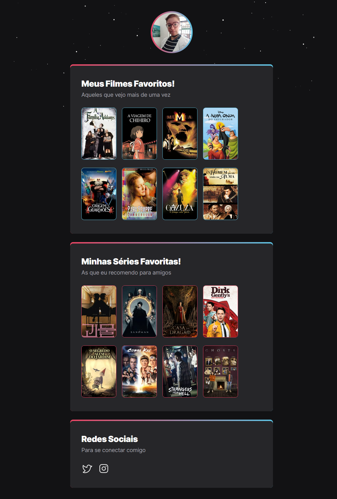

# NLW eSport Desafio

<b>Trilha Explorer</b>

Um projeto desenvolvido durante o evento
<b>Next Level Week</b> da Rocketseat.

[Clique aqui para acessar](https://linest-10.github.io/Desafio-NLW)

## <b>Meu aprendizado</b>

Através desse projeto coloquei em prática o que aprendi no NLW eSport da Rocketseat.
Com a ajuda da comunidade do discord da Rocketseat fiz as seguintes alterações:

- Uso do <i><b>{justify-content:center;}<i><b> na section ul para organização
- Uso do <i><b>{justify-content: flex-start}<i><b> no social-list para voltar a posição originalmente 
sugerida pela equipe da Rocketseat

## <b>Tecnologias</b>

- HTML
- CSS
- GIT e GITHUB
- FIGMA

## <b>Meus contatos</b>

alinealbuquerqueprofi@gmail.com 
whatsapp (11) 95892-8769